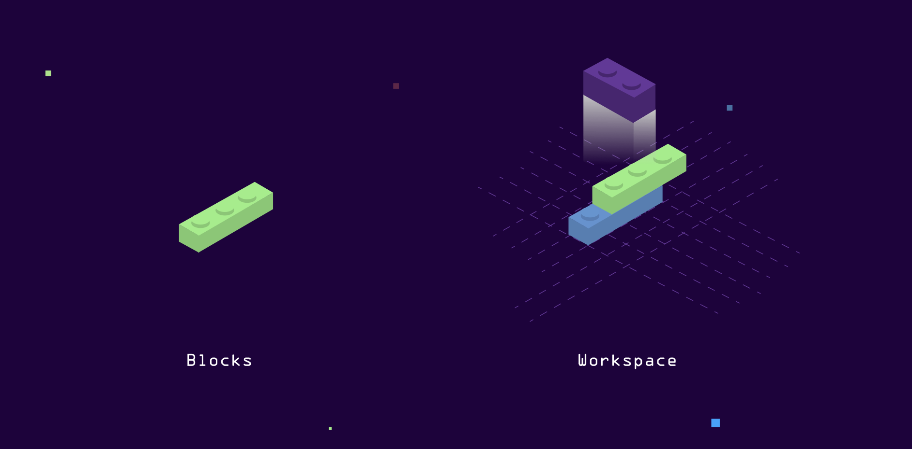

<p align="center">
    
</p>

<p align="center">
  <a href="https://discord.gg/8cQZfXWeXP" alt="Discord">
    
  </a>
  <a href="https://github.com/polycrate/polycrate/blob/main/go.mod" alt="Go version">
    
  </a>
  <a href="https://github.com/polycrate/polycrate/releases" alt="Releases">
    
  </a>
  <a href="https://docs.polycrate.io" alt="Docs">
    
  </a>
</p>

Polycrate is a framework that lets you package, integrate and automate complex applications and infrastructure. With Polycrate you can bundle dependencies, tools, cofiguration and deployment logic for any kind of IT system in a single workspace and expose reusable actions that enable a streamlined DevOps workflow.

## What is Polycrate



If you're working with modern cloud native tooling you most likely know the pain of dependency- and tool-management, the mess of git-repositories to get Infrastructure-as-Code working and the leaking portability when it comes to working in a team. Polycrate helps you to glue all the command-line tools, configuration files, secrets and deployment scripts together, package it into a version-controlled workspace and provide a seemless way to expose well-defined actions that allow for easy replication and low-risk execution of common workflows.

Polycrate does this by wrapping logic in so called blocks - custom code that you can write in the language of your choice - and execute them inside a Docker container that provides well-integrated best-of-breed tooling of modern infrastructure development. These blocks can be shared through a standard OCI registry or git-repositories, making a workspace portable between any system that supports Docker.

You can share workspaces with your team or customers and make them use pre-defined actions that setup, change or destroy the systems defined in it with simple commands like `polycrate run docker install`.

## Quick start

### Install Polycrate

To see more examples on how to install Polycrate, please refer to our [docs](https://docs.polycrate.io/6_installation)

```bash
curl https://docs.polycrate.io/get-polycrate.sh | bash
polycrate version
```

### Create your first workspace

- Create a workspace directory: `mkdir -p $HOME/.polycrate/workspaces/my-workspace`
- Enter the directory: `cd $HOME/.polycrate/workspaces/my-workspace`
- Create the workspace configuration and a first block:

```yaml
cat <<EOF > workspace.poly
name: my-workspace
extraenv:
  - "YOUR_NAME=Max Mustermann"
blocks:
  - name: hello-world
    config:
      your_name: "Max Mustermann"
    actions:
      - name: greet
        script:
          - echo "HELLO WORLD"
      - name: greet-me
        script:
          - echo "HELLO $YOUR_NAME"
      - name: greet-me2
        script:
          - echo "HELLO $BLOCK_CONFIG_YOUR_NAME"
      - name: show-workspace
        script:
          - echo "This is workspace '$WORKSPACE_NAME'"
EOF
```

Now run the following commands:

- `polycrate run hello-world greet`
- `polycrate run hello-world greet-me`
- `polycrate run hello-world greet-me2`
- `polycrate run hello-world show-workspace`

### TL;DR

- The first action simply echoes `Hello World` because you defined it like that.
- The second action took an additional environment variable that you defined at workspace level and echoed what you set as a value. With `polycrate --env "ANOTHER_NAME=Santa Claus" --env "YET_ANOTHER_NAME=John Doe"` you can inject further environment variables at runtime.
- The third action echoed the content of another environment variable that Polycrate automatically created for you by converting the block's config path to env vars: `block.config.your_name` -> `BLOCK_CONFIG_YOUR_NAME`. 
- The fourth action shows that the magic from action number 3 works with every stanza in a workspace configuration, even with workspace-level settings like `workspace.name` which converts to `WORKSPACE_NAME`.

---

For more examples on how to get started, please visit our [docs](https://docs.polycrate.io/1_getting-started)

## Why Polycrate

- Simple commands to execute complex, pre-configured deployment or installation logic
- No need to locally install abstract toolchains and conflicting dependencies when working with tools like Ansible, Kubernetes or Terraform
- No knowledge of the logic of single blocks is necessary to use the exposed actions
- Build complex but well-integrated systems based on a single configuration file
- No custom DSL or complex configuration structure to learn: Polycrate lets you build on your own terms with minimum constraints, giving you the ability to configure your workspace and blocks the way YOU need to
- Share the operational load of managing complex systems in production with your team
- Works with and improves existing tools - no need to rewrite existing code to work with Polycrate. Just make a block out of it and expose it as an action
- Use tools like Ansible to achieve idempotent deployments inside your blocks
- Share common logic by pushing blocks to an OCI-comptabible registry
- Share workspaces through git-repositories
- Automatically persist and sync workspace changes to a git-repository when running an action

## Play with Polycrate

- [Installation](https://docs.polycrate.io/6_installation)
- [Quick start](https://docs.polycrate.io/1_getting-started)
- [Examples](https://docs.polycrate.io/examples)

## Support

For community support, please visit the following places:

- [GitHub Issues](https://github.com/polycrate/polycrate/issues)
- [Discord](https://discord.gg/8cQZfXWeXP)

For enterprise support, please contact us at [hello@ayedo.de](mailto:hello@ayedo.de) or visit [www.ayedo.de](https://www.ayedo.de) for further information.

## Copyright & License

Copyright (c) 2021-2022 Ayedo Cloud Solutions GmbH - Released under the Sustainable Use License. Polycrate and the Polycrate Logo are trademarks of Ayedo Cloud Solutions GmbH.